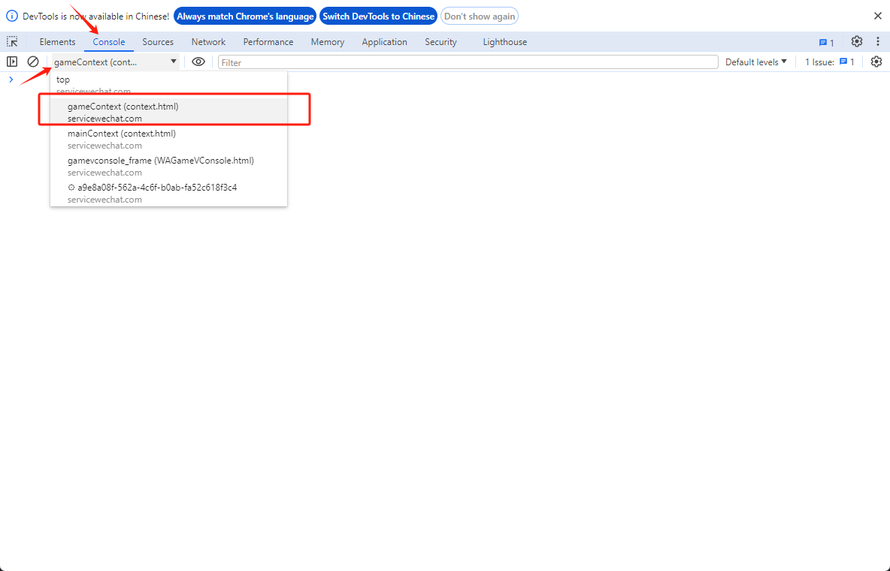
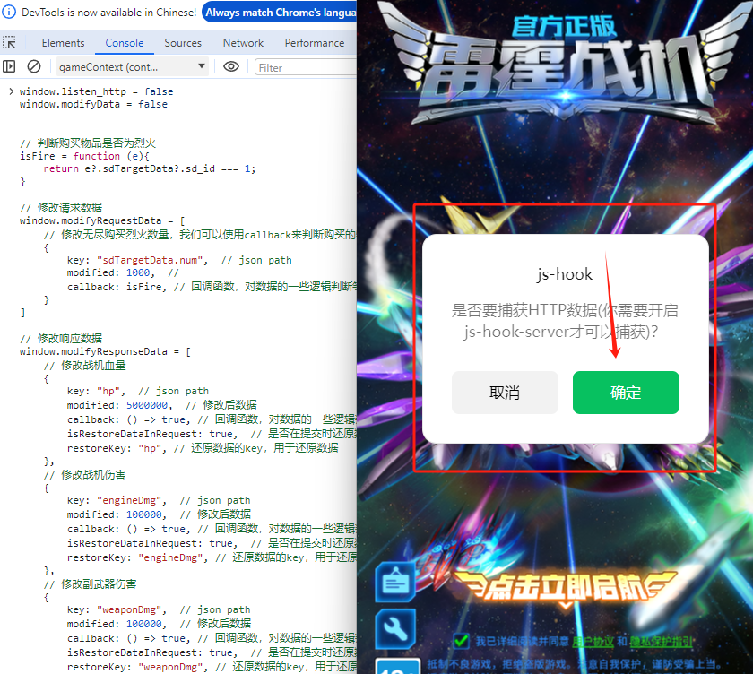
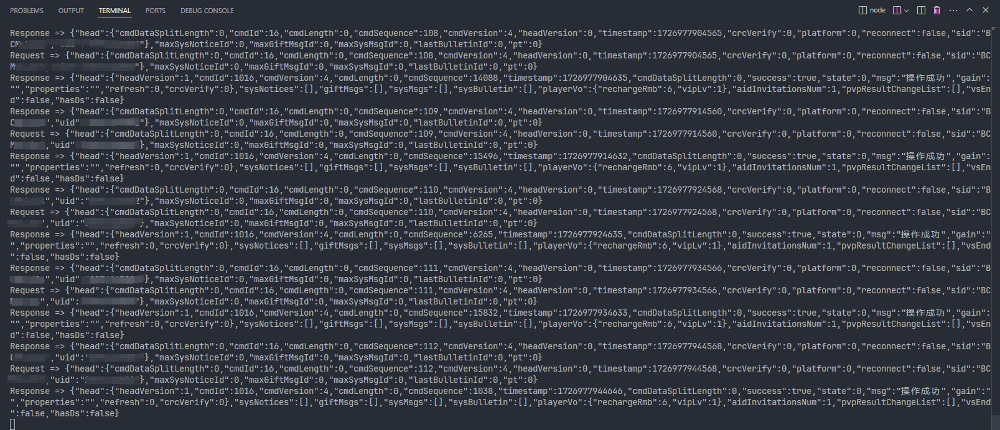
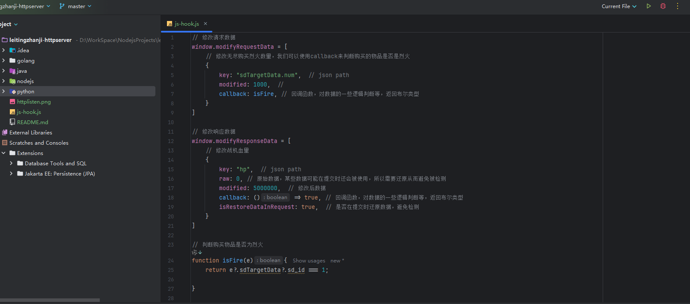

## 声明

本项目仅适用于`雷霆战机`小程序。

本项目仅供学习交流使用，请勿用于商业、非法用途。转载请注明出处。

## 前言

使用`js hook`来获取雷霆战机加密前的数据和解密后的数据，简化抓包过程。

同样可以使用`js hook`来实现对数据的修改，从而达到像`SunnyNetTools`、`HttpCanary`等抓包工具的规则替换效果。

使用`js hook`无需考虑加解密算法，只需关注数据格式即可。

我们提供了两种hook与hook-server的通信方式，分别为`http`和`ws`。

* [x] http模式：单向通信，仅允许小程序向hook-server发送数据。
* [ ] ws模式：双向通信，允许hook-server和小程序互相发送数据。在ws模式中你可以直接调用小程序的加密解密方法。

如果你没有特殊需求，http模式已经足够了。

## 使用方法


我们提供了`nodejs`、`Python`、`Java`、`Golang`版本的服务端，请根据需要选择。

1. 下载对应版本的服务端，解压到非中文目录。
2. 安装必要的依赖。
3. 启动服务端。
4. 下载`js-hook.js`代码
5. 使用`WeChatOpenDevTools`打开对应小程序的控制台
6. 在控制台输入`js-hook.js`代码

```javascript
// 动态开启或关闭数据监听
window.listenData = true || false;

// 动态开启或关闭修改数据
window.modifyData = true || false;

// 动态添加要修改的数据
window.modifyResponseData.push({
        key: "hp",  // json path
        modified: 5000000,  // 修改后数据
        callback: () => true, // 回调函数，对数据的一些逻辑判断等，返回布尔类型
        isRestoreDataInRequest: true,  // 是否在提交时还原数据，避免检测
        restoreKey: "hp", // 还原数据的key，用于还原数据
})
```

### 注意

在控制台输入`js-hook`代码时需将`Console`的上下文环境切换到`gameContext`。



当完成以上步骤后，你可以在对应服务端上看到请求数据，并且你可以修改`js hook`的一些代码实现对数据修改。



## 修改数据

### 开启和关闭修改数据

你可以在控制台中动态修改他。

```javascript
// 当为true时，则代表开启数据修改功能
window.modifyData = true || false
```

我们在`js hook`代码中添加了修改数据的功能，你可以在`js hook`代码中修改`modifyRequestData`、`modifyResponseData`变量，实现对数据修改。

## 预览

### 数据监听



### 数据修改



## 参考

- [https://github.com/JaveleyQAQ/WeChatOpenDevTools-Python](https://github.com/JaveleyQAQ/WeChatOpenDevTools-Python)